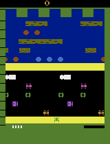

# Part 1: DQN + Extensions and Rainbow DQN for Frogger ALE Environment

This part of the project focuses on training agents to play the **Frogger** game using **Deep Q-Learning (DQN) + Extensions** and its variant, **Rainbow DQN**.

---

## Environment Setup

To install the necessary dependencies, use the `environment_part1.yml` file provided in this repository. The file contains all the libraries required for this project.

### Steps:
1. Install Miniconda or Anaconda.
2. Run the following command to create the environment:
   ```bash
   conda env create -f enviroment_part1.yml
    ```# Part 1: DQN + Extensions and Rainbow DQN for Frogger ALE Environment

This part of the project focuses on training agents to play the **Frogger** game using **Deep Q-Learning (DQN) + Extensions** and its variant, **Rainbow DQN**.

## Table of Contents
1. [Environment Setup](#environment-setup)
2. [Project Description](#project-description)
3. [Implemented Algorithms](#implemented-algorithms)
4. [Results and Comparisons](#results-and-comparisons)

---

## Environment Setup

To install the necessary dependencies, use the `environment.yml` file provided in this repository. The file contains all the libraries required for this project.

### Steps:
1. Install Miniconda or Anaconda.
2. Run the following command to create the environment:
   ```bash
   conda env create -f part1.yml
    ```
3. Activate the environment:
   ```bash
   conda activate part1
    ```

## How to Run the Code

Follow these steps to train or evaluate the agents:

1. **Train the Agents**:

   - **DQN + Extensions**:
    The notebook is self-explainatory:
    ```bash
    DQNWithSomeExtensions.ipynb
    ```

   - **Rainbow DQN**:
     Run the training script for the PPO agent:
     ```bash
     python rainbow_dqn.py
     ```

2. **Evaluate the Agents**:

    - **Evaluation of both Agents**:
    The notebook is self-explainatory:
    ```
    Evaluations.ipynb

# Project Description

This project aims to train reinforcement learning agents to solve the **Frogger** game using two approaches:

### DQN + Extensions  
An enhanced version of Deep Q-Learning that improves training stability and learning efficiency through:  
- **Double DQN**: Reduces overestimation bias of Q-values.  
- **Dueling DQN**: Separates state-value and action-advantage calculations.  
- **Prioritized Experience Replay**: Focuses on transitions with higher errors for faster learning.

### Rainbow DQN  
A more advanced version of DQN combining several techniques to improve exploration and learning:  
- **Double DQN**  
- **Dueling DQN**  
- **N-Step Prioritized Replay**  
- **Noisy Layers**: Adds learnable noise to network weights for better exploration.  
- **Plateau-aware Gaussian Noise Injection**: Detects training plateaus and injects Gaussian noise to encourage further exploration.

The agents are trained to maximize the reward by successfully navigating the frog across busy roads and rivers to its goal.

---

# Implemented Algorithms

## DQN + Extensions

- **Key Components**:  
  - Double DQN  
  - Dueling DQN  
  - Prioritized Experience Replay  

- **Preprocessing**:  
  - Frame skipping: `16`  
  - Image resizing: `84x84`  
  - Stacking last `4` frames to capture motion  
  - Normalization: Pixel values scaled to `[0, 1]`  

- **Hyperparameters**:  
  - Learning Rate: `0.0001`  
  - Discount Factor (Gamma): `0.9`  

- **Performance**:  
  - Achieves a mean reward of **265.4** with a standard deviation of **128.07** over 100 test episodes.  
  - Successfully solves the environment (reward = 400) in some episodes.  

---

## Rainbow DQN

- **Key Components**:  
  - Double DQN  
  - Dueling DQN  
  - N-Step Prioritized Replay  
  - Noisy Layers with dynamic Gaussian noise injection  

- **Preprocessing**:  
  - Identical to DQN + Extensions  

- **Hyperparameters**:  
  - Learning Rate: `0.0001`  
  - Discount Factor (Gamma): `0.9`  

- **Innovation**:  
  - Gaussian noise injection allows the agent to explore more effectively during training plateaus.  

- **Performance**:  
  - Achieves a mean reward of **114.97** with a standard deviation of **0.89** over 100 test episodes.  
  - Learns faster initially but plateaus earlier.  

---

# Results and Comparisons

## Visual Demonstration

**DQN + Extensions**:  


**Rainbow DQN**:  


---

## Evaluation Metrics

| **Metric**          | **DQN + Extensions**    | **Rainbow DQN**     |
|----------------------|-------------------------|----------------------|
| Mean Reward          | 265.4                  | 114.97              |
| Standard Deviation   | 128.07                 | 0.89                |

---

## Observations

1. **Performance**:  
   - **DQN + Extensions** achieves better long-term performance and more stable results.  
   - **Rainbow DQN** learns faster initially due to improved exploration but plateaus early.

2. **Exploration**:  
   - Noisy layers in **Rainbow DQN** provide better exploration, especially when training begins to stall.

3. **Training Dynamics**:  
   - Gaussian noise injection effectively helps escape plateaus but requires fine-tuning to maintain long-term performance.

4. **Frame Skipping**:  
   - A frame skip value of `16` significantly accelerates learning without sacrificing essential observations.

---

## Summary

| **Algorithm**        | **Strengths**                                | **Weaknesses**                             |
|-----------------------|---------------------------------------------|--------------------------------------------|
| **DQN + Extensions** | Stable performance, higher long-term rewards | Slower initial learning                    |
| **Rainbow DQN**       | Faster initial learning, improved exploration | Early plateau, requires careful noise tuning |

Both approaches are effective, with **DQN + Extensions** being better suited for long training sessions, while **Rainbow DQN** excels in short-term learning.

---

## Next Steps

1. **Hyperparameter Tuning**: Further optimize noise parameters and replay settings for Rainbow DQN.  
2. **Extended Training**: Train both models for a larger number of episodes to analyze long-term convergence.  
3. **Behavior Analysis**: Study the agents' behavior in specific scenarios to improve performance.


